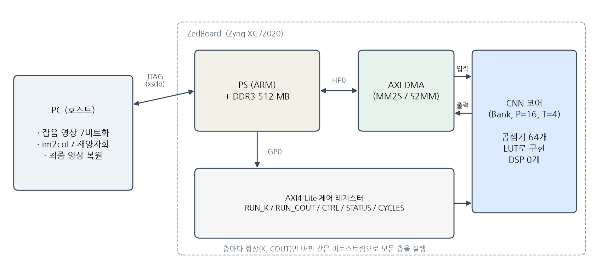
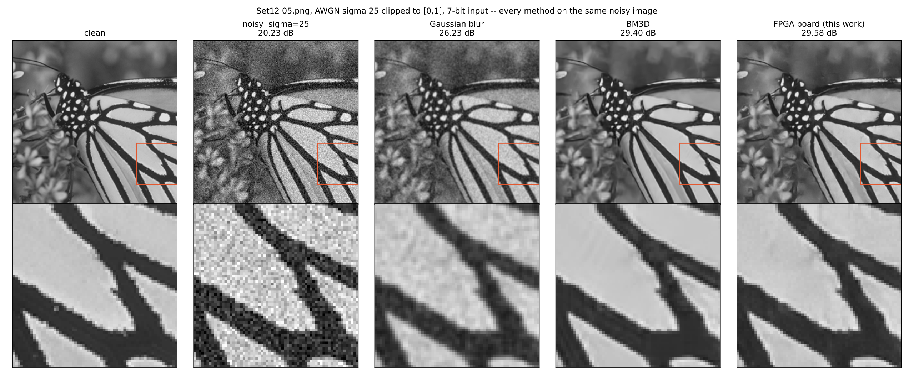

# FPGA 기반 CNN 영상 잡음 제거 가속기의 설계와 보드 검증

**— DSP 블록 없이 LUT만으로 구현한 단일 비트스트림 CNN 가속기 —**

| 항목 | 내용 |
|---|---|
| 소속 | 정보통신공학과 |
| 작성자 | (이름 / 학번) |
| 지도교수 | (지도교수) |
| 사용 장비 | ZedBoard (AMD Zynq-7000 XC7Z020), Vivado 2026.1 |

---

## 1. 개요

잡음이 섞인 영상을 FPGA가 받아 깨끗한 영상으로 복원하는 CNN 가속기를 설계하고, 실제 보드에서 검증한다.

- **하드웨어:** 하나의 비트스트림이 층마다 형상(입력 수 K, 출력 채널 수 COUT)만 바꿔 가며 신경망 전체를 실행한다. 곱셈기 64개는 DSP 블록 없이 LUT로만 구현했다.
- **현재까지의 결과:**
    - 7층 잡음 제거 CNN을 보드에서 실행했다. 출력 1,264만 개가 PC 정수 모델과 **비트 단위로 일치**했다.
    - PSNR은 20.23 dB에서 29.58 dB로 올랐다(Set12 05.png, 가우시안 잡음 σ=25).
    - 표준 테스트셋 BSD68에서 고전 최강 기법 BM3D보다 높은 화질을 냈다(28.56 dB 대 28.37 dB).
    - 보드에서 측정한 사이클 수는 설계 단계의 예측과 1.7% 이내로 일치했다.

## 2. 배경 및 필요성

**영상 잡음 제거의 필요성.** 저조도 촬영, 소형 이미지 센서, 무선 전송 과정에서 영상에는 잡음이 섞인다. 잡음은 화질을 떨어뜨리고 이후의 인식·분석 성능도 낮춘다.

**CNN과 연산량 문제.** 딥러닝 기반 잡음 제거(DnCNN 등)는 고전 기법(BM3D 등)보다 화질이 좋다. 그러나 픽셀 하나에 수만 번의 곱셈·덧셈이 필요하다. 카메라 모듈이나 드론 같은 엣지 기기에서는 GPU를 쓰기 어려우므로, 저전력 전용 하드웨어(FPGA, NPU)로 가속해야 한다.

**소형 FPGA의 제약.** XC7Z020에는 DSP 블록이 220개뿐이고, 실제 시스템에서는 DSP가 다른 신호처리에도 쓰인다. 본 설계는 곱셈기를 DSP 없이 LUT로 구현하므로 DSP를 전부 다른 용도로 남겨 둘 수 있다.

**반도체 설계 관점.** 이 과제는 AI 반도체(NPU)를 설계할 때의 전 과정을 작은 규모로 그대로 수행한다.

- RTL 설계
- UVM 기반 검증
- FPGA 프로토타이핑
- 하드웨어 제약을 반영한 신경망 설계와 양자화
- 실측으로 검증한 성능 모델

## 3. 목표

| 항목 | 목표 | 현재 상태 |
|---|---|---|
| 화질 (σ=25) | 표준 테스트셋에서 BM3D 수준 이상 | BSD68 28.56 dB > BM3D 28.37 dB ✅ Set12 29.55 dB < BM3D 29.95 dB (개선 중) |
| 정확성 | 보드 출력 = PC 정수 모델 (비트 단위) | 7개 층, 출력 12,648,448개 불일치 0 ✅ |
| 처리 시간 | 256×256 영상 1장, 코어 계산 3초 이내 (50 MHz) | 2.33 s ✅ |
| 하드웨어 자원 | DSP 0개, LUT 25% 이하 | DSP 0, LUT 21.0%, BRAM 50.7% ✅ |
| 성능 예측 | 설계 단계 사이클 모델 오차 5% 이내 | +1.7% ✅ |

## 4. 관련 연구 및 차별성

| 연구 | 내용 |
|---|---|
| BM3D (Dabov et al., 2007) | 비슷한 영상 조각을 모아 함께 처리하는 고전 기법. 딥러닝 이전의 최고 성능 |
| DnCNN (Zhang et al., 2017) | 17층 CNN과 잔차 학습으로 BM3D를 넘어섬. 본 과제 망 구조의 기반 |
| FFDNet (Zhang et al., 2018) | 영상을 2×2로 나눠 절반 해상도에서 처리해 속도를 높임 |
| 대한민국 반도체설계대전 23회 학부 수상작 | "CNN 기반 FPGA 노이즈 제거기"(충남대), "잡음 제거를 위한 딥러닝 하드웨어 가속기 설계"(이화여대) |

본 과제가 기존 작품과 다른 점은 다음과 같다.

1. **DSP 없는 구현:** 곱셈기 64개를 LUT로만 구현했다(DSP 사용 0개).
2. **단일 비트스트림:** 층마다 형상만 레지스터로 바꿔서, 비트스트림 하나로 모든 층을 실행한다. 같은 비트스트림으로 CIFAR-10 분류(6층)와 잡음 제거(7층)를 모두 실행했다.
3. **검증 수준:**
    - 보드 결과를 PC 정수 모델과 출력 하나하나 비트 단위로 비교한다.
    - RTL은 UVM 검증 환경(랜덤 자극, 참조 모델, 커버리지, 프로토콜 assertion)으로 검증했다.
    - 검증 환경이 실제로 버그를 잡는지도 확인했다. RTL에 버그 10개를 일부러 넣었고 10개 모두 검출됐다.
4. **실측으로 검증한 성능 모델:** 하드웨어 사이클을 설계 단계에서 예측하고, 보드 실측과 비교해 1.7% 이내로 맞음을 확인했다.

## 5. 제안 방법

### 5.1 시스템 구성

- **PC(호스트)**
    - 잡음 영상을 7비트로 바꾼다.
    - 층마다 입력을 창(window) 형태로 펼친다(im2col).
    - 가속기 출력을 다음 층 입력으로 재양자화한다.
    - 마지막 층 출력으로 최종 영상을 만든다.
- **ZedBoard:** 데이터는 JTAG으로 DDR에 올린다. AXI DMA가 HP0 포트를 통해 가속기 코어로 스트리밍하고, 결과를 다시 DDR에 쓴다. 제어는 AXI4-Lite 레지스터로 한다.

### 5.2 가속기 코어

- **연산:** 창 하나(활성값 K개)에 대해 COUT개 채널의 `ReLU(bias + Σ 가중치 × 활성값)`을 계산한다. 가중치는 INT8, 누산은 INT32, 활성값은 7비트이다.
- **구조:** 16개 lane × 4개 bank로, 사이클마다 곱셈 64개를 수행한다(P=16, T=4).
    - 다음 창의 입력을 받는 동안 현재 창을 계산한다(창 간 중첩).
    - 0인 활성값은 건너뛸 수 있다(sparse 모드).
- **런타임 형상:** 최대 K=1152, COUT=128로 빌드했다. 층마다 RUN_K, RUN_COUT 레지스터에 실제 형상을 쓴다.
- **사이클 모델:** 창 하나의 비용은 `max(K, ⌈COUT/P⌉ × ⌈K/T⌉)` 사이클이다. 입력 포트가 사이클당 활성값 1개를 받으므로 K보다 빨라질 수 없다.

### 5.3 하드웨어 제약을 반영한 망 설계

- **망 구조:** DnCNN을 축소한 7층 × 32채널(3×3 합성곱, 파라미터 47,018개)이다.
- **제약 1 — 7비트 입력:** 잡음 영상을 [0, 1]로 자르고 7비트로 양자화한다. 학습할 때도 똑같이 처리한다.
- **제약 2 — 출력에 항상 ReLU:** DnCNN은 잡음(음수 포함)을 예측하는데, 이 하드웨어는 음수를 낼 수 없다. 그래서 마지막 층이 **깨끗한 영상을 직접 출력**하게 한다. 대신 잡음 영상을 마지막 층에 한 번 더 입력(skip)해서 "입력을 베끼고 고치는" 경로를 준다.
- **양자화:**
    - 배치 정규화를 합성곱에 합쳐 넣는다.
    - 가중치는 출력 채널별 INT8로 양자화한다.
    - 활성값 범위는 99.99 퍼센타일로 잡는다. 이 값은 테스트셋이 아닌 검증용 학습 영상 40장으로 골랐다.
    - 이렇게 해서 정수 변환 손실은 −0.12 dB이다.

### 5.4 검증 방법

1. **RTL 검증 (UVM):**
    - AXI-Lite·AXI-Stream 에이전트, 참조 모델 스코어보드, 기능 커버리지, AXI 핸드셰이크 SVA로 구성했다.
    - UVM 1.2에서 39/39, IEEE 2020판에서 26/26이 통과했다(출력 38,809개, 레지스터 읽기 7,114개 비교).
    - 일부러 넣은 버그 10개를 모두 검출했다.
2. **보드 검증:** 층마다 보드 출력을 정답(oracle)과 보드 쪽에서 비트 단위로 비교한다. 최종 PSNR도 PC 정수 모델 값과 같아야 한다.
3. **성능 검증:** 층별 사이클 카운터(CYCLES)를 사이클 모델 예측과 비교한다.

## 6. 현재까지의 결과

### 6.1 화질 (평균 PSNR, σ=25, 모든 기법 동일한 잡음 영상)

| 방법 | Set12 (12장) | BSD68 (68장) |
|---|---|---|
| 잡음 영상 | 20.33 dB | 20.48 dB |
| 미디언 필터 3×3 | 25.43 dB | 24.89 dB |
| 가우시안 필터 | 26.56 dB | 26.13 dB |
| BM3D | **29.95 dB** | 28.37 dB |
| **제안 (보드 정수 모델)** | 29.55 dB | **28.56 dB** |

- 모든 기법은 하드웨어 조건(클리핑 + 7비트)에서 직접 다시 측정했다. 논문 수치를 옮겨 적지 않았다.
- 필터 세기는 학습 영상으로 골랐다.
- BSD68에서는 68장 중 51장에서 BM3D보다 높다.
- Set12에서 진 차이는 대부분 반복 무늬가 많은 두 영상(Barbara, House)에서 나왔다. 사진 전체에서 비슷한 조각을 찾는 BM3D에 유리한 영상이다.

*그림: Set12 05.png. 왼쪽부터 원본, 잡음(20.23 dB), 가우시안(26.23 dB), BM3D(29.40 dB), **FPGA 보드 출력(29.58 dB)**. 아래 줄은 빨간 상자 부분을 확대한 것이다.*

### 6.2 보드 실측 (Set12 05.png, 256×256, PL 50 MHz)

| 층 | K | COUT | 측정 사이클 | 사이클/창 | 불일치 |
|---|---|---|---|---|---|
| conv1 | 9 | 32 | 2,097,167 | 32.0 | 0 |
| conv2~6 (각각) | 288 | 32 | 18,939,961~18,939,969 | 289.0 | 0 |
| conv7 | 297 | 1 | 19,529,755 | 298.0 | 0 |
| **합계** | | | **116,326,747** | 픽셀당 1,775 | **0** |

- 코어 계산 시간은 영상 한 장에 **2.33초**(50 MHz)이다.
- 사이클 모델 예측(픽셀당 1,746)보다 1.7% 많다.
    - 차이의 대부분은 K가 작은 첫 층에서 생긴다. 창 하나에 고정 비용이 있어서 9를 예측했지만 32가 측정됐다.
    - 나머지 층은 창마다 +1 사이클이다.
- JTAG 전송 시간은 이 숫자에 들어 있지 않다.

**같은 비트스트림의 이전 검증.** CIFAR-10 분류 CNN(6층)을 테스트 영상 128장으로 실행했다.

- 정확도 85.94%(110/128)였다.
- 출력 14,680,064개가 모두 비트 단위로 일치했다.
- 영상 한 장에 13.24 ms(75.5 fps)였다.

### 6.3 화질 개선 시도 (같은 학습 조건에서 비교)

| 시도 | 아이디어 | Set12 (보드) | 보드 비용 | 결과 |
|---|---|---|---|---|
| 기준 | 깨끗한 영상 출력 + skip | **29.55 dB** | 1,775 사이클/픽셀 | 채택 |
| ① 부호 분리 잔차 학습 | 마지막 층을 (w, b), (−w, −b) 두 채널로 만듦. ReLU(z) − ReLU(−z) = z로 ReLU 하드웨어에서도 잡음을 오차 없이 예측 | 29.34 dB | 약 1,737 (추정) | 화질 향상 없음 |
| ② 절반 해상도 처리 (FFDNet 방식) | 창 수가 1/4이 된 만큼 채널을 2배(64)로. 한 픽셀이 보는 범위 15×15 → 약 42×42 | 29.23 dB | 약 1,314 (추정, −26%) | 더 빠르지만 화질 낮음 |

- **① 잔차 학습:** float 성능은 같았다(−0.02 dB). 정수로 바꿀 때 손실이 더 컸다. 하드웨어 수정 없이 부호 있는 출력을 정확히 얻는 기법 자체는 동작함을 확인했다.
- **② 절반 해상도:** 파라미터가 6.4배인데 학습 손실이 더 높아, 학습이 덜 된 것으로 판단했다. 현재 검증셋 기반 조기 종료로 다시 학습하고 있다. 공정한 비교를 위해 기준 모델도 같은 조건으로 함께 학습한다.

## 7. 추진 계획

| 단계 | 내용 | 산출물 |
|---|---|---|
| 1 | 조기 종료 기반 재학습으로 최종 모델 확정. ②가 기준 모델과 같은 화질에 도달하면, 보드 비용이 26% 적은 ②를 채택 | 최종 모델, 비교표 |
| 2 | Set12 256×256 영상 7장 전체 보드 실측. 레이어별 사이클과 JTAG 전송 시간 분리 측정 | 보드 실측 표 |
| 3 | PL 클럭 상향 실측(비트스트림은 100 MHz 제약에서 WNS +0.221 ns로 타이밍 충족, 지금은 보드 기본 설정 50 MHz), Vivado 전력 분석, ARM 프로세서(PS) 단독 실행과 속도 비교 | 속도·전력 비교표 |
| 4 | 결과 정리, 보고서·발표 자료 작성, 대한민국 반도체설계대전 출품 검토 | 최종 보고서 |

## 8. 기대 효과

- **엣지 영상처리:** 범용 GPU 없이 소형 FPGA 하나로 고전 최강 기법 수준의 잡음 제거를 수행한다. DSP를 쓰지 않으므로 같은 칩의 다른 신호처리와 함께 탑재할 수 있다.
- **반도체 설계·검증 역량:** RTL 설계, UVM 검증, FPGA 프로토타이핑, 하드웨어를 고려한 신경망 설계와 양자화, 실측 기반 성능 모델까지 NPU 개발 흐름 전체를 직접 수행한다.
- **재현성:** 데이터 다운로드, 학습, 양자화, 보드 실행, 그림 생성이 모두 스크립트로 되어 있다. 누구나 같은 결과를 다시 만들 수 있다.

## 9. 참고문헌

1. K. Dabov, A. Foi, V. Katkovnik, K. Egiazarian, "Image Denoising by Sparse 3-D Transform-Domain Collaborative Filtering," *IEEE Trans. Image Processing*, 2007.
2. K. Zhang, W. Zuo, Y. Chen, D. Meng, L. Zhang, "Beyond a Gaussian Denoiser: Residual Learning of Deep CNN for Image Denoising," *IEEE Trans. Image Processing*, 2017.
3. K. Zhang, W. Zuo, L. Zhang, "FFDNet: Toward a Fast and Flexible Solution for CNN-Based Image Denoising," *IEEE Trans. Image Processing*, 2018.
4. W. Shang, K. Sohn, D. Almeida, H. Lee, "Understanding and Improving Convolutional Neural Networks via Concatenated Rectified Linear Units," *ICML*, 2016.
5. 한국반도체산업협회, 제23회 대한민국 반도체설계대전 수상작 목록.
6. AMD, *Zynq-7000 SoC Technical Reference Manual* (UG585); *AXI DMA LogiCORE IP Product Guide* (PG021).
